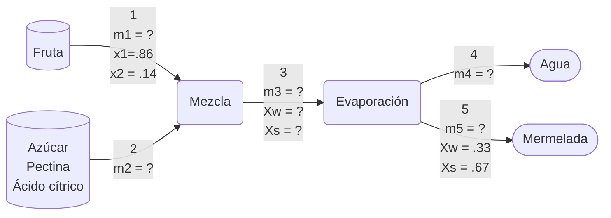

>[!Info]
>Clase: Balance de materia y energía
>Fecha: 

---
# Problema 1
Una mezcla líquida que contiene 45.0% de benceno (B) y 55.0% de Tolueno (T) por masa se alimentan a una columna de destilación.
La corriente de producto que sale por la parte superior de la columna (producto ligero) contiene 95.0% mol de B y la corriente de producto que sale por la parte inferior contiene 8.0% del benceno alimentado en la columna.
La velocidad de alimentación es 2000 L/h y la gravedad específica de la mezcla de la alimentación es 0.872.
Determine:
1) Velocidad de flujo másico de la corriente superior;
2) Velocidad de flujo másico de la corriente inferior y su composición másica.
---
**Datos:**
- $m1 = 2000 \frac{L}{h}$
- $X_\text{B(m1)} = .45$
- $X_\text{T(m1)} = .55$
- $m2 = ?$
- $X_\text{B(m2)} = .95$
- $X_\text{T(m2)} = .05$
- $X_\text{B(m3)} = .08$
- $X_\text{B(m3)} = .92$
- $g = 0.872$

---
# Problema 2
Algunos pescados se procesan como harina de pescado para usarse como proteínas suplementarias en alimentos.
En el proceso empleado primero se extrae el aceite para obtener una pasta que contiene 80% en peso de agua y 20% en peso de harina seca.
Esta pasta se procesa en secadores de tambor rotatorio para obtener un producto “seco” que contiene 40% en peso de agua.
Finalmente, el producto se muele a grano fino y se empaca.
1) Calcule la alimentación de pasta en kg necesaria para producir 1000 kg de harina “seca”.
	1) **3000**
2) Sabiendo que el proceso dura 3.5 h, cuantos lotes se pueden procesar en 2 turnos de 8 horas.
	1) Se pueden realizar esa operación **4.5 veces**
	2) **4571.42kg**
	3) **4 lotes de 1000kg** + 571kg
3) Si la harina se empaca en presentaciones de 250 g, cuantos paquetes se producirán en ese mismo tiempo.
	1) **18284**
4) Finalmente, si se tiene una requisición de 140,000 paquetes, en cuanto tiempo se tendrá completo.
	1) **122500*
---
**Datos:**
- $m1 = ?$
- $X_\text{W(m1)} = .8$
- $X_\text{H(m1)} = .2$
- $m2 = ?$
- $X_\text{W(m2)} = .4$
- $X_\text{H(m2)} = .6$

---
# Problema 3
Después de leer el siguiente texto, correspondiente al proceso de producción de jalea, indique la secuencia de pasos por bloques y responda las interrogantes que se formulan.
La fruta se limpia y se eliminan la dermis y los pedúnculos, luego se lava y se tritura; la fruta contiene 86% de agua y 14% de sólidos solubles.
Una vez triturada, se mezcla con azúcar en una proporción de 45 a 55% en peso, en este paso también se agrega pectina y ácido cítrico, con lo que el pH alcanza un valor de 3,5.
Luego, esta mezcla se somete a una evaporación de 80°C por 20-30 minutos, con lo cual se elimina agua y la concentración de sólidos en el producto resulta ser de 67% en peso.

---
**Datos:**
- {PENDIENTE}

---
1) ¿Cuáles son las materias primas empleadas en el proceso productivo y cómo se clasifican éstas por su origen y su composición? ¿Qué fenómenos físicos (operaciones unitarias) se llevan a cabo?
	1) Materias empleadas:
		1) Fruta
			1) De origen vegetal
			2) Composición orgánica
		2) Agua
		3) Azúcar
			1) De origen vegetal
			2) Composición orgánica
		4) Pectina
			1) De origen vegetal
			2) Composición orgánica
		5) Ácido cítrico
			1) De origen vegetal
			2) Composición orgánica
	2) Fenómenos físicos
		1) Evaporación
2) ¿Qué desechos resultan del proceso?
	1) Restos de fruta
		1) Dermis y pedúnculos
	2) Agua
3) ¿Cuáles son las condiciones de operación?
	1) pH a 3.5
	2) Evaporación a 80°C
4) ¿En qué tipo de empresa se clasificaría el proceso?
	1) Sector secundario o industrial
5) Esquematice el proceso con las entradas y salidas.

