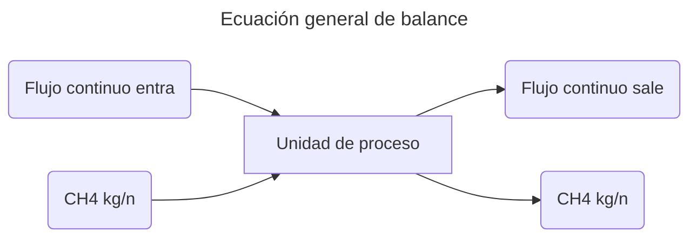
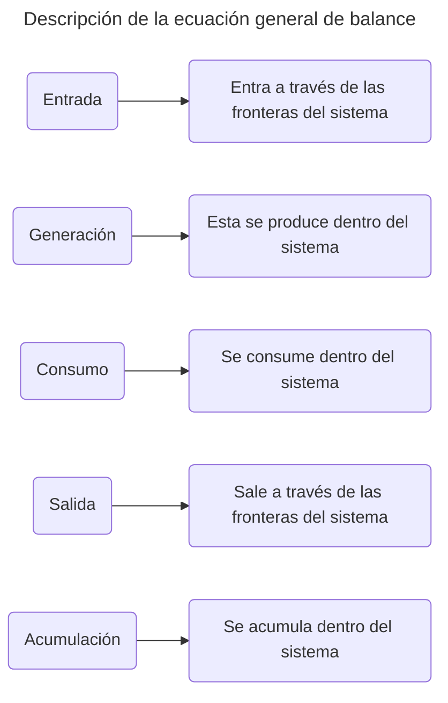

>[!Info]
>Clase: Balance de materia y energía
>Fecha: 05/Sept/2025

---

Suponga que el metano es un componente de las corrientes de entrada y salida de una unidad de proceso continuo donde las velocidades de flujo másico de metano en ambas corrientes son distintas.
¿Qué es lo que está pasando?, ¿el metano se consume como reactivo o se genera como producto en el interior de la unidad?, ¿se acumula en la unidad quizá por adsorción sobre las paredes?, ¿hay fugas de metano en la unidad?, ¿hay errores en la medición?
#### Ecuación general
$$
E_{(Entrada)}+G_{(Generación)}-C_{(Consumo)}-S_{(Salida)}=A_{(Acumulación)}
$$
Cuando $A=0$ significa que no existe acumulación, por lo que después de igualar a 0 se puede simplificar en 2 fórmulas dependiendo de si existe reacción química en el proceso.
#### Ecuación sin acumulación con reacción
$$
E+G=C+S
$$
#### Ecuación sin acumulación sin reacción
$$
E=S
$$

