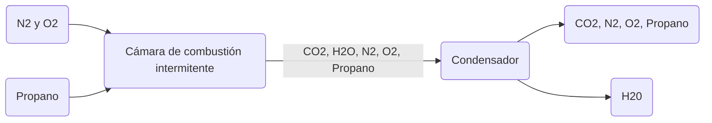

>[!Info]
>Clase: Balance de materia y energía
>Fecha: 12/Sept/2025

---
Existen varios procedimientos para obtener las variables desconocidas de un proceso
# 1 - Diagrama de flujo
Una vez indicado el diagrama se describen los valores y unidades  de todas las variables en los sitios en que indica la corriente. Asigne números algebraicos a las variables desconocidas de las corrientes y escriba en el diagrama los nombres de estas variables y las variables conocidas.
### Ejemplo 1
Suponga que un gas inerte ($N_2$ y $O_2$) se combina con propano en una cámara de combustión intermitente en la cual parte del oxígeno (pero no todo) reacciona con el propano para formar $CO_2$ y agua, y después el producto se enfría y el agua se condensa.

# 2 - Escala del diagrama de flujo y base de cálculo
El proceso de cambiar valores de todas las cantidades  velocidades de flujo de las corrientes por una cantidad proporcional sin que las composiciones de las corrientes cambien se denomina **ajuste de escala del diagrama de flujo**, y puede ser:
- Escala aumentada
- Escala reducida
# 3 - Balance de proceso - ¿Cómo saber cuántas ecuaciones son necesarias en el balance?
El número máximo de ecuaciones independientes que pueden derivarse escribiendo balances en un sistema no reactivo es igual al número de especies químicas en las corrientes de entrada y de salida. Se escriben primero aquellos balances que incluyan el menor número de variables desconocidas.
# 4 - Análisis de grados de libertad
Es la diferencia entre el número de ecuaciones independientes menos el número de incógnitas y para que el balance de masas pueda realizarse el número de grados de libertad debe ser 0.
1) Ecuación para cálculo de grados de libertad: $ndf=N_{Incognitas}-N_{\text{Ecuaciones independientes}}$
2) Interpretación de resultados de resultados:
	1) $ndf=0$ : Hay $n$ ecuaciones independientes con $n$ incógnitas y el problema, en principio, puede ser resuelto
	2) $ndf<0$ : Hay más incógnitas que ecuaciones independientes que las relacionen, por tanto, si se omitió una relación es muy probable que hacer los cálculos resulte en una pérdida de tiempo, pues no se puede resolver.
	3) $ndf>0$ : Hay más ecuaciones independientes que incógnitas, por tanto, tampoco tiene caso resolverlas.
