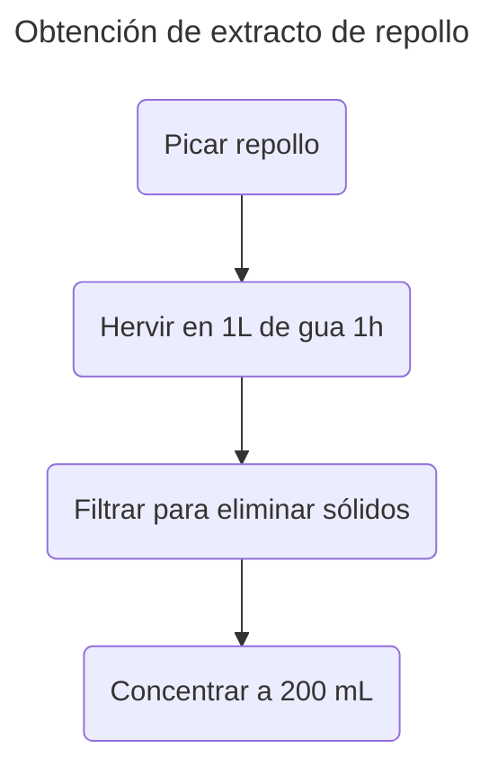

>[!Info]
>Autor(es): Xie et al.
>Publicación: 2025

> [!Abstract] 
> Se informa la fabricación y prueba exitosa de dos tiras de empaque inteligentes diferentes basadas en compuestos de quitosano reticulados que contienen (i) curcumina y (ii) antocianinas de repollo rojo. Las tiras inteligentes se analizaron utilizando técnicas analíticas seleccionadas, incluida la espectroscopía infrarroja de transformación de Fourier (FTIR), el análisis termogravimétrico (TGA), la microscopía electrónica de barrido de emisión de campo (Fe-SEM), la calorimetría de escaneo diferencial (DSC) y la espectroscopía de espectros UV-Visible (UV-vis). Se evaluó la resistencia a la tracción de los materiales, determinando valores para películas que contienen curcumina (CVGCURC) y películas que contienen antocianina (CVGRCE) de 9.5 y 9.9 MPa, respectivamente. Los ángulos de contacto del agua superficial se determinaron como 84.7 ± 3 ° y 56.5 ± 5 ° para películas CVGCURC y CVGRCE. Furthermore, both intelligent film strips demonstrated strong UVblocking capacities and good barrier properties to water vapor, determined as 2.6 × 10−10 ± 0.6 × 10−11 g·m−1·s−1·Pa−1 and 3.65 ×  10−10 ± 0.8 × 10−11, g·m−1·s−1·Pa−1 for CVGCurc and CVGRCE films, respectivamente. En general, las propiedades fisioquímicas determinadas muestran valores prometedores para ambas películas para la aplicación como tiras de empaque inteligentes, con CVGCURC que muestra un rendimiento mejorado en investigaciones mecánicas, de barrera e térmica. Finalmente, las tiras de película se aplicaron a un estudio de degradación de langostinos, evaluando el cambio de color activado por el pH con el tiempo. Ambas películas mostraron un cambio de color significativo con un aumento en el pH dentro del espacio de cabeza de envasado, con películas CVGRCE que muestran el mayor valor ΔE (47.9). Por lo tanto, estas dos películas inteligentes ofrecen un estudio de prueba de concepto para la aplicación de películas de quitosano reticuladas a envases inteligentes. De hecho, las películas pueden considerarse un punto de partida prometedor para el desarrollo y comercialización de materiales de envasado inteligentes simples, verdes y rentables para ayudar a los consumidores en un esfuerzo por minimizar el desperdicio de alimentos domésticos.
### [Fuente](https://pubs.acs.org/doi/10.1021/acsfoodscitech.5c00483)
---
# Introducción

	Tanto las tiras de películas inteligentes CVGCURC como CVGRCE son candidatos fuertes para el desarrollo futuro de tiras de empaque inteligentes sostenibles para monitorear la frescura de la carne y el pescado, con CVGRCE que funciona mejor en general.

	Priyadarshi et al. (2021) Revisaron el uso de colorantes alimentarios naturales en envases inteligentes con aplicaciones específicas en el monitoreo de frescura de los productos de carne, mariscos y lácteos.

	La curcumina se extrae de la cúrcuma y se ha investigado en combinación con varios polímeros para su uso en materiales de envasado de alimentos, que ofrece excelentes propiedades antimicrobianas y antioxidantes, así como una capacidad de indicador de pH.10 La curcumina es un compuesto halocrómico con un cambio de color a pH> 7 y, por lo tanto, es un indicador efectivo para monitorear la frescura de los alimentos proteicos perpetibles.

[[Curcumin - A promising bioactive agent for application in food packaging systems|Aliabbasi et al., 2021]]

	El cambio de color de las antocianinas como resultado de un aumento en el pH se debe a la desprotonación de su estructura, que cambia la longitud de onda de la luz absorbida por el compuesto.
# Metodología

	Una planta de repollo rojo (Waitrose) se picaron aproximadamente y se hirvió en 1 l de agua durante 1 h para extraer las antocianinas.
	El líquido se filtró para eliminar los sólidos y se concentró a 200 ml.

# Discusión

	A medida que el pH aumenta de 7 a 10, la curcumina gira de amarillo a rojo/ naranja debido a la desprotonación de grupos hidroxilo, formando un producto de enolato más estable y conjugado. Del mismo modo, las antocianinas de repollo rojo cambian de color en soluciones básicas o cuando están expuestas a un entorno básico. Las películas que contienen antocianina cambian de color de amarillo a verde/azul debido a la desprotonación de los grupos de fenol.54 Antocianinas de repollo rojo también cambian de color a una solución rosa en un entorno ácido;
# Conclusión

	... tanto las tiras de películas inteligentes CVGCURC como CVGRCE son candidatos fuertes para el desarrollo futuro de tiras de empaque inteligentes sostenibles para monitorear la frescura de la carne y el pescado, con CVGRCE que funciona mejor en general.