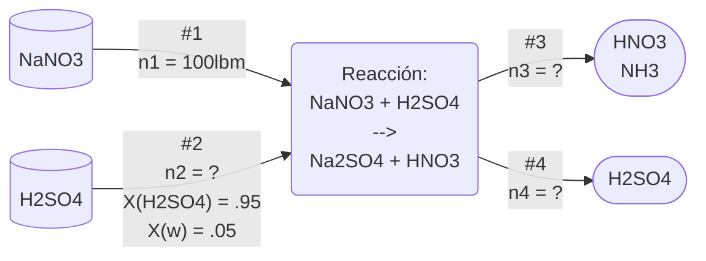

>[!Info]
>Clase: Balance de materia y energía
>Fecha: 02/Oct/2025

---
# Ejemplo 1
En el proceso ordinario para la fabricación de ácido nítrico ($HNO_3$) se trata nitrato de sodio ($NaNO_3$) con ácido sulfúrico ($H_2SO_4$) que contiene 95% de $H_2SO_4$ en masa.
Para que la pasta que resulta pueda fluidizarse es conveniente emplear ácido suficiente de forma que haya un 34% de $H_2SO_4$ en peso en la pasta final.
Este exceso de ácido sulfúrico en realidad estará combinado con el sulfato de sodio ($Na_2SO_4$) de a pasta formando bisulfato de sodio ($NaHSO_3$), tambien llamado sulfato ácido de sodio, aunque para efectos de cálculo puede considerarse como ácido libre.
Puede suponerse que la pasta contiene 1.5% de agua en peso y el resto del agua sale en el $HNO_3$ producido.
Puedes suponer que la reacción es completa y que el 2% de $HNO_3$ permanece en la pasta. El $NaSO_3$ es puro y está seco.
1) Calcule el peso y composición porcentual de la pasta formada por 100lbm de $NaNO_2$ cargado.
2) Calcule el peso de ácido diluido que ha de emplearse por 100lbm de $NaNO_2$
3) Calcule la composición de la solución acuosa de $HNO_3$ producida por 100lbm de $NaNO_3$
## Datos
- $n1_{(NaNO_3)} = 100lbm$
- $n2_{(H_2SO_4)} = ?$
	- $x_{(H_2SO_4)} = .95$
	- $x_w = .05$
- $n3 = ?$
	- $HNO_3$
	- $NH_3$
- $n4 = ?$
	- $H_2SO_4$
	- $H_2O$
	- $Na_2SO_4$
	- $HNO_3$
## Reacción
$$
\begin{split}
NaNO_3 \ + \ H_2SO_4 &\Longrightarrow Na_2SO_4 \ + \ HNO_3
\\
&\downarrow
\\
2NaNO_3 \ + \ 1H_2SO_4 &\Longrightarrow 1Na_2SO_4 \ + \ 2HNO_3
\end{split}
$$
## Diagrama

## Cálculo
$$
\begin{split}
&\text{1) Cambiar lbm a lbmol}
\\
\\
\text{100lbm}_{NaNO_3} \ * \ \frac{\text{1 lbmol}}{\text{85 g}} &= \text{1.176 lbmol }{NaNO_3}
\\
\\
&\text{2) Moles producidos de }HNO_3
\\
\\
\text{1.176 lbmol }_{NaNO_3} \ * \ \frac{\text{2 }HNO_3}{\text{2 }NaNO_3} &= \text{1.176 lbmol }{HNO_3}
\\
\\

\end{split}
$$
