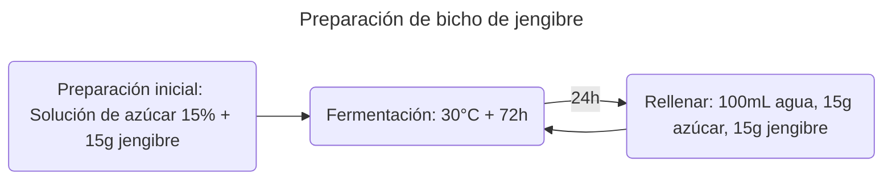
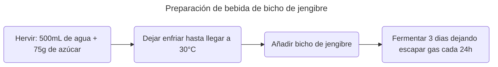

>[!Info]
>Autor(es): Rachma Sari et al.
>Publicación: 2024

> [!Abstract] 
> La tendencia actual en bebidas funcionales es utilizar especias, una de ellas es jengibre, relacionada con los compuestos bioactivos que contienen. Por lo tanto, el jengibre tiene el potencial de proporcionar beneficios para la salud e inhibir el crecimiento bacteriano. Las bebidas de jengibre fermentadas utilizando el error de jengibre como inicio con varias concentraciones afectan la calidad de las bebidas fermentadas. El propósito del estudio fue determinar el crecimiento de la población de microorganismos en el error de jengibre, y analizar las características microbiológicas (recuento de bacterias de ácido láctico, levadura y moho), características químicas (acidez titulable y pH), y también la inhibición de microbios de bebidas funcionales de jengibre fermentado con diferentes concentraciones de injerto de jengibre. Se usó un diseño completamente aleatorizado con tratamientos de concentración de errores de jengibre que consisten en 5%, 10%, 15%, 20%y 25%. Esta investigación puede representar datos de la población de errores de jengibre de 5,5 x 106 CFU/ml de bacterias de ácido láctico y 1x103 CFU/ml de levadura y moho. La conclusión es que la concentración de error de jengibre 15% produjo una alta actividad de inhibición de bacterias 4.82 mM; Total BAL 4.69x107; levadura y moho 9.50x102; ph 4,17; Acidez titulable 0,68%; por los requisitos de SNI para bebidas fermentadas.
### [Fuente](https://repository.usm.ac.id/files/proceding/Z518/20250519051157-proceding-Z518.pdf)
---
# Metodología

	Los bichos de jengibre se realizaron de acuerdo a () con modificaciónes.
	Una solución de 15% de azúcar hecha en el frasco de vidrio  es añadida a 15 g de jengibre  picado y luego es fermentado a 30°C por 72 horas.
	Cada 24 horas 100 mL de agua, 15 g de jengibre y 15 g de azúcar son agregados al fraco y se agita.

	Una bebida funcional de jengibre fue hecha de acuerdo a () con modificaciones
	La bebida es hecha hirviendo 500 mL de agua y 75 g de azúcar a 100°C por 5 min.
	La solución es dejada a enfriar hasta 30°C, y despues se le añade bicho de gengibre de acuerdo al tratamiento.
	Subsecuentemente, una fermetación es llevada a cabo por 3 dias, abriendo cada 24 horas la tapa por unos minutos para reducir la presión del gas formado.

# Discusión

	El recuento de bacterias de ácido lácticas (LAB en inglés) se ve afectado significativamente por la concentración de bicho de jengibre (P <0,05).
	Tiende a disminuir en línea con el aumento de las concentración de bicho de jengibre.

	...la creciente concentración de bicho de jengibre provoca una disminución en la disponibilidad del sustrato, por lo que la actividad de autopropagación disminuye.
	Otro factor sospechoso establecido por (Pranayanti, 2015) es que la disminución de la disminución en el número de LAB se produjo debido a la acumulación de metabolitos secundarios, como el peróxido de hidrógeno, que es producida por LAB.

	Esto está en línea con (Jannah et al., 2014), que la disminución en el pH del medio y la acumulación de ácidos orgánicos como resultado de los metabolitos de fermentación son los principales factores que causan una disminución en la supervivencia de los organismos probióticos.

Existe una relación inversa entre la concentración de bicho de jengibre agregado a la bebida fermentada y la población de bacterias ácido lácticas.
Esto puede ser ocasionado por diversos factores, por ejemplo:
1) Una disminución en la disponibilidad de sustrato necesario para el crecimiento de las LAB.
2) Acumulación de metabolitos secundarios ($H_20$, por ejemplo).
3) Cambios en el pH por la acumulación de ácidos orgánicos.
.
 
	La levadura y el recuento de moho se ve afectado significativamente por la concentración de bicho de jengibre (P <0,05).
	Tiende a disminuir en línea con el aumento de las concentraciones de errores de jengibre.
	Se sospecha que había anti-moho y levadura secretada por las bacterias ácido lácticas.

	..., referente a (Illianingtyas et al., 2006), el ácido láctico producido por las LAB pueden inhibir el crecimiento de la levadura y de moho.

	Referente a (Israr et al., 2022), también afirmó que el gingerol y la oleorresinas, como los ingredientes activos primarios en los rizomas del jengibre fresco podrían ser un agente antifúngico.

Existe una relación inversa entre la concentración de bicho de jengibre agregado a la bebida fermentada y el recuento de levaduras y moho en el producto final. Esto puede deberse a diferentes causas:
1) Que las LAB hayan excretado sustancias anti-moho y anti-levaduras.
2) Que el ácido láctico haya inhibido el crecimiento de estos.
3) Que algunos de los ingredientes activos primarios de los rizomas del jengibre, como el gingerol y la oleorresina, puedan ser agentes antifuńgicos.
.

	El pH se ve afectado significativamente por la concentración de errores de jengibre (P <0,05).
	Tiende a disminuir en línea con el aumento de las concentraciones de bicho de jengibre agregadas.

	Esta disminución se debe al aumento del ácido láctico. Esto está en línea con (Elsaputra et al., 2016), que el pH se ve afectado y se reduce por la acumulación de ácido láctico.

	Referente a (Pranayanti et al., 2015), explicó que la disminución del pH es causada por la liberación de protones H+ en un medio de fermentación.

Existe una relación inversa entre la concentración de bicho de jengibre agregada a la bebida fermentada y el pH del producto final. Esto debido a lo siguiente:
1) La  acumulación de ácido láctico en el medio.
2) La liberación de protones ($H⁺$) al medio a causa de la fermentación
.

	Luego, (Jannah et al., 2014) también reveló que cuantas más fuentes de azúcar se metabolizan, más ácidos orgánicos se producen para que el pH sea más bajo.

a
