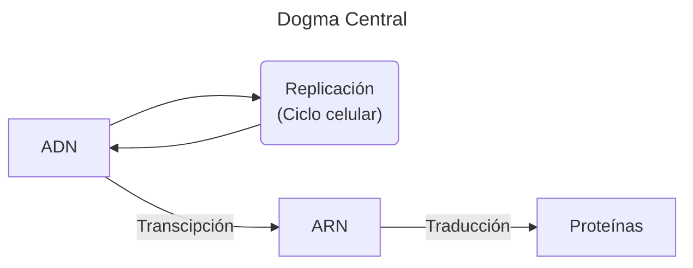

>[!Datos]
>Clase: Biología celular
>Profesorx: 
>Fecha: 20/Mar/2025

---

### Replicación
- Proceso de duplicación del ADN.
- Su objetivo es la conservación de la información genética.
- Proceso semiconservativo.
### Transcripción
Proceso por el cual se genera una copia de ARNm para que luego genere una proteína.

- **Maduración**: Se retiran intrones (partes no codificantes) y se empalman los exones (partes codificantes).
### Traducción
- Proceso de traducir una secuencia de ARNm a una secuencia de aminoácidos.
- Este proceso es realizado por los ribosomas.
- Es guiado por codones y anticodones.