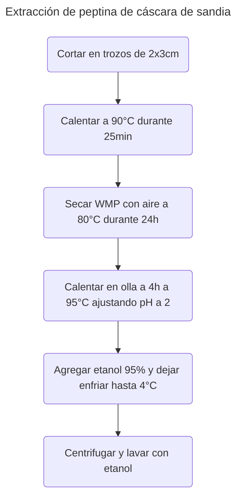
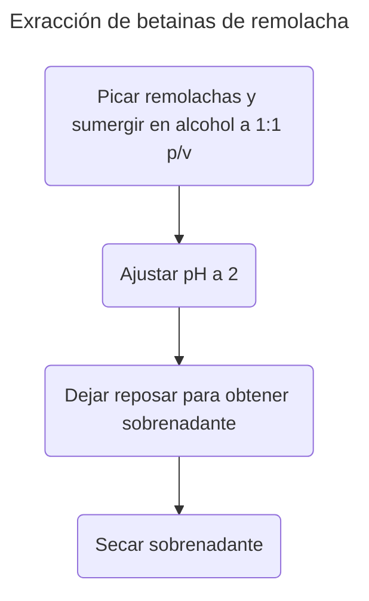
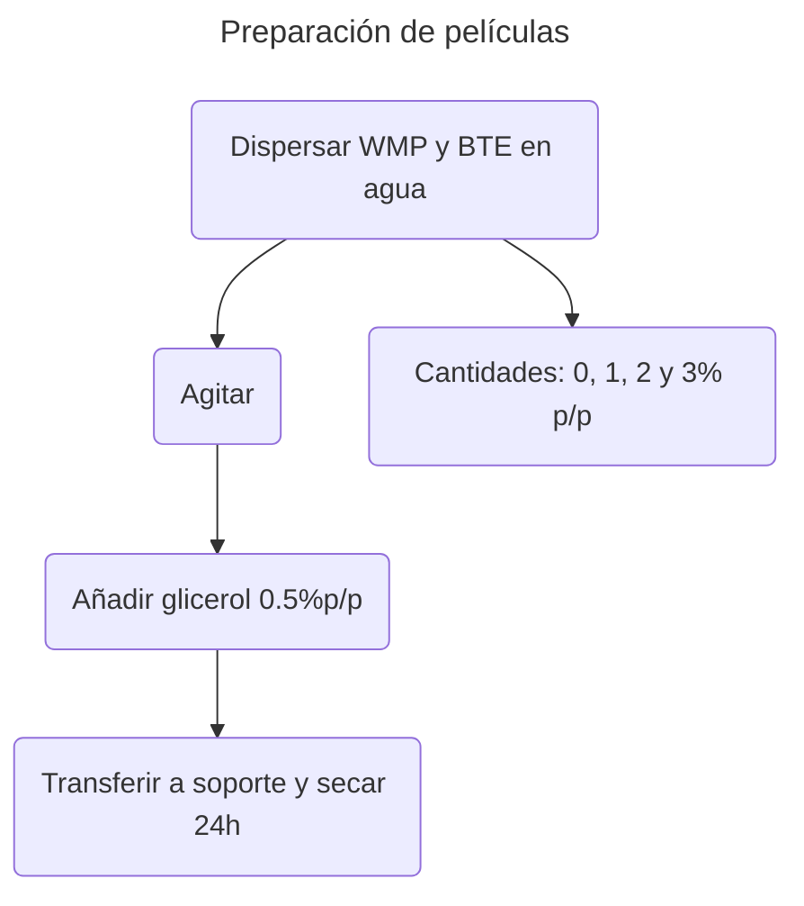
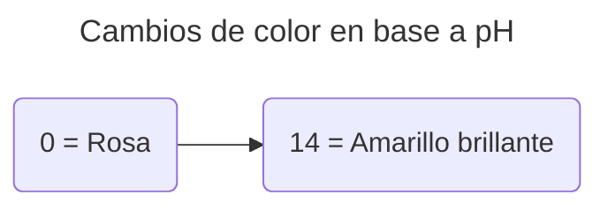

>[!Info]
>Autor(es): Guo et al.
>Publicación: 2021

> [!Abstract] 
> Preparamos una película indicadora sensible al pH que incorpora extracto de remolacha (BTE, 0, 1, 2 y 3%, p/p) encapsulada en pectina desde cáscara de sandía (WMP) para monitorear los cambios de calidad de la carne fría durante el almacenamiento. Los resultados mostraron que un bajo contenido de BTE (hasta 2%) condujo a una reducción de la permeabilidad al oxígeno (OP) y la permeabilidad del vapor de agua (WVP) y una mejora de las propiedades mecánicas. La transmitancia de luz de las películas WMP/BTE disminuyó y la estabilidad térmica mejoró al aumentar el contenido de BTE. Por lo tanto, una película que contiene 2% BTE (WMP/BTE2) exhibió la mejor actuación. El lanzamiento de BTE de la película WMP fue controlado por difusión. Además de una buena estabilidad del color en condiciones naturales, la película WMP/BTE2 mostró una respuesta colorimétrica en una amplia gama (3-10) de valores de pH. El color de la película WMP/BTE2 cambió de rosa (día 0) a marrón (día 8) que se asoció con el deterioro de la carne fría. Los resultados anteriores indican que WMP/BTE2 tiene un gran potencial para monitorear la calidad de la carne fría.
### [Fuente](https://annas-archive.org/scidb/10.1016/j.foodhyd.2021.106751/)
---
# Metodología
	La pectina se extrajo de WMP de acuerdo con el método descrito por Lu et al. (2019).

[[Extraction and characterization of pectin from Premna microphylla Turcz leaves|Lu et al., 2019]]

	El WMP se cortó manualmente en trozos pequeños (aproximadamente 2×3 cm) e inmediatamente se colocó en agua caliente (90°C) durante 25 minutos para inactivar las enzimas.
	Luego, el WMP se secó en un horno de secado de aire caliente a 80°C durante 24 h.
	Posteriormente, el WMP seco se calentaron en una olla de inducción (durante 4h a aproximadamente 95°C y luego se usó HCl para ajustar el pH a 2±0.3.
	El extracto de pectina se agregó a etanol al 95% y se permitió pararse a 4°C durante 12 h.
	A continuación, se centrifugó a 3000 rpm y el precipitado se lavó 3 veces con etanol absoluto para eliminar los pigmentos, los lípidos y los azúcares de moléculas pequeñas antes de secar al vacío.

	Los extractos de remolacha se prepararon de acuerdo con el método de Liu et al., (2019).

[[TiO 2x - Ag3 PO4 photocatalyst - Oxygen vacancy dependent visible light photocatalytic performance and BPA degradative pathway|Liu et al., 2019]]

	Las remolachas (200g) se picaron y se sumergieron en 200ml de agua de etanol (7:3,v/v)
	El pH de la mezcla se ajustó a 2±0.2 por ácido acético. La mezcla se incubó en un agitador (200rpm) a 20°C durante 12h y luego se centrifugó (5 min, 5000g).
	El sobrenadante se secó en una congelación y el polvo se recogió y almacenó a 4°C.

	Las películas se prepararon de acuerdo con el método de lanzamiento de la solución.
	La pectina de WMP (4g DL^-1) y varias cantidades de BTE (0, 1, 2, 3%, p/p) se dispersaron a temperatura ambiente en agua destilada.
	La suspensión de pectina se agitó a 40°C durante 30 minutos con un agitador magnético a 300rpm y se añadió glicerol (0,5% p/p) como plastificante.
	La solución se transfirió a una placa de Petri de plástico (10×10 cm) y se secó a 40°C por debajo del 40% de humedad relativa (HR) durante 24h.

# Discusión

	El color de las soluciones cambió de color rosa a amarillo brillante al aumentar los valores de pH

	Esto se debió a la transformación estructural reversible de la antocianidina (MA, Du y Wang, 2017).

[[Tara gum-polyvinyl alcohol-based colorimetric NH3 indicator films incorporating curcumin for intelligent packaging|Ma, Du y Wang, 2017]]

	Tanto la permeabilidad del oxígeno (OP) como la permeabilidad del vapor de agua (WVP) disminuyeron de (...) en (WMP/BTE0) a (...) en (WMP/BTE0).
	(...)
	La disminución de OP y WVP podría deberse al hecho de que las rutas de entrada de oxígeno y humedad fueron interrumpidas o prolongadas debido a las interacciones de enlace de hidrógeno entre la matriz de pectina y BET (Rodsamran y Sothornvit, 2019).

[[Lime peel pectin integrated with coconut water and lime peel extract as a new bioactive film sachet to retard soybean oil oxidation|Rodsamran y Sothornvit, 2019]]

	Mientras tanto, los grupos hidrofóbicos, como los compuestos fenólicos, del extracto de la planta evitan que las moléculas de agua penetren en la película (Lalnunthari, Devi y Badwaik, 2019).

[[Direct Transformation of Muskmelon Seeds Meal into Biodegradable Films and Their Characterization|Lalnunthari, Devi y Badwaik, 2019]]

	A baja dosis, la adición de extractos vegetales aumenta la barrera de oxígeno, pero a una dosis alta disminuye la barrera de oxígeno de las películas. (Andrade et al., 2018; Menzel et al., 2019; Staroszczyk et al., 2019).

[[Characterization of rosemary and thyme extracts for incorporation into a whey protein based film|Andrade et al., 2018]]
[[Antioxidant starch films containing sunflower hull extracts|Menzel et al., 2019]]
[[Fish gelatin films containing aqueous extracts from phenolic-rich fruit pomace|Staroszczyk et al., 2019]]

	La resistencia a la tracción de las películas WMP tuvo un aumento significativo (P <0.05) a medida que el contenido de BET aumentó hasta un 2% porque la interacción de los puentes de hidrógeno entre el BTE y la matriz de WMP fortalece la red de películas (Menzel et al., 2019).

[[Antioxidant starch films containing sunflower hull extracts|Menzel et al., 2019]]
# Conclusión
	La pectina extraída de las cáscaras de sandía tiene una buena capacidad de formación de películas y a bajas concentraciones (hasta al 2%) BTE se dispersó uniformemente en la matriz de pectina que formaba interacciones de enlace de hidrógeno.

---
	La presencia de BTE mejoró las propiedades de barrera de oxígeno y agua, propiedades -mecánicas y de barrera de luz, y estabilidad térmica de las películas.

---
	La muestra WMP/BTE2 exhibió la mejor actuación.