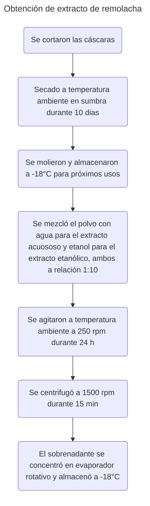

>[!Info]
>Autor(es): Abadi et al.
>Publicación: 2024

> [!Abstract] 
> En este estudio, la película comestible de alcohol polivinílico de quitosano (C) que contiene nanopartículas de plata biofabricadas (NAG) (como agente antimicrobiano) y extracto de cáscara de remolacha (BRPE) (como agente antioxidante e indicador de pH) se usó como indicador de deterioro en filetes refrigerados de trucha arcoíris. La actividad de eliminación radical DPPH (2,2-difenil-1-pinlhidrazil) (43.02%), la potencia reductora (2.87) y el contenido fenólico total (360.50 mg GAE/G) de BRPE etanólico fueron más altos que el extracto acuoso. Las nanopartículas de plata se biosintetizan mediante reducción de nitrato de plata por quitosano, confirmado por espectroscopía UV-visible, imágenes ópticas y de microscopio electrónico de barrido y análisis de difracción de rayos X. La mayor resistencia a la tracción (4.20 MPa) y el alargamiento al descanso (118%) pertenecían a la película CP-BRPE, y la permeabilidad de vapor de agua más baja (2.45 10−5 g/s/m/p) estaba relacionada con la película CP-NAG. Also, the lowest total viable count (6.17 log CFU/g), psychrotrophic bacteria (6.27 log CFU/g), Enterobacteriaceae (4.9 log CFU/g), pH (5.66), total volatile basic-nitrogen (TVB-N) (22.1 mg/100 g of fish), and thiobarbituric acid reactive substances (TBARS) (0.705 Los valores de MG MDA/kg de FISH) de los filetes de trucha empaquetados se observaron significativamente (P ≤ 0.05) en el tratamiento CP-BRPE-GNAG entre los otros tratamientos al final del período de almacenamiento, y los tratamientos CP-GNAG, CP-BRPE y CP estaban en los siguientes rangos, respectivamente. El análisis colorimétrico de las películas usadas mostró que las películas que contienen espectros de color representados de BRPE de rojo a amarillo al mismo tiempo que los síntomas de deterioro iniciados en los filetes envasados. Se concluye que BRPE no solo aumentó los efectos conservadores de la película de alcohol de quitosano-polivinílico que contiene nanopartículas de plata verde, sino que también puede considerarse como un indicador de deterioro rentable natural de los filetes de trucha de arco iris durante el tiempo de almacenamiento en frío.
### [Fuente](https://onlinelibrary.wiley.com/doi/epdf/10.1002/fsn3.4605)
---
# Introducción

	La cáscara de remolacha roja (beta vulgaris) es rica en pigmentos rojos llamados betalainas. Las betalainas son un grupo de compuestos nitrogenados que son solubles en agua, no tóxicas y sensibles a los cambios de pH. Consisten en dos partes: betaxantina amarilla-naranja y betacyanina roja (Fu et al., 2020).

[[Red Beetroot Betalains - Perspectives on Extraction, Processing, and Potential Health Benefits|Fu et al., 2020]]

	...las películas comestibles que contienen extracto de pulpa de remolacha mostraron una respuesta de color seguido de los cambios de pH de los alimentos malcriados (Guo et al., 2021).

[[Active-intelligent film based on pectin from watermelon peel containing beetroot extract to monitor the freshness of packaged chilled beef|Guo et al., 2021]]
# Metodología

	Las cáscaras se cortaron con un cuchillo y se secaron a temperatura ambiente bajo sombra durante 10 días.
	Luego, las muestras secas se molieron y almacenaron a -18°C para los próximos usos.
	Se añadió polvo de cáscara de raíz de remolacha a cada uno de los agua (extracto acuoso) y etanol al 70% (extracto etanólico) en una relación 1:10.
	La mezcla se agitó a temperatura ambiente a 250 rpm durante 24h y luego se centrifugó a 1500 rpm durante 15 min.
	Luego, el sobrenadante se concentró en un evaporador rotativo y se almacenó a -18°C para los próximos análisis (Guo et al., 2021)

[[Active-intelligent film based on pectin from watermelon peel containing beetroot extract to monitor the freshness of packaged chilled beef|Guo et al., 2021]]

# Discusión

	...el disolvente acuoso-alcohólico mostró más capacidad para liberar los ingredientes fenólicos de la cáscara de la raíz de remolacha que el solvente de agua.

a
# Conclusión

	...como desperdicio de alimentos, el BRPE mostró una respuesta de color apropiada contra un rango de pH de 3-12 y representaba el deterioro del filete de trucha en la película de CP. Por lo tanto, el BRPE es un compuesto sensible al pH y puede considerarse como un indicador de pH natural y rentable en envases inteligentes.

	La película de quitosano que contiene nAG y BRPE mejoró la vida útil de los filetes de trucha arcoiris refrigerados durante 12 días del período de almacenamiento.

