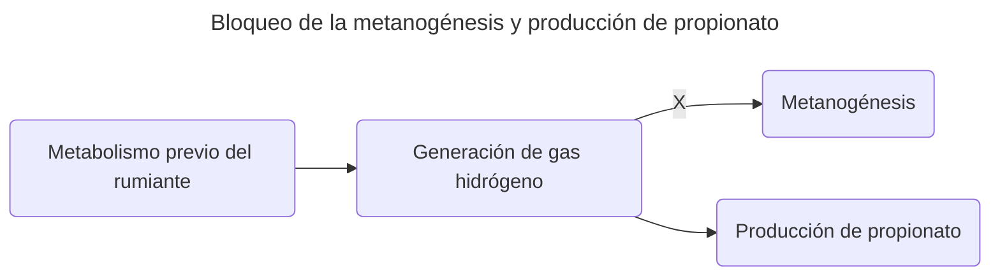
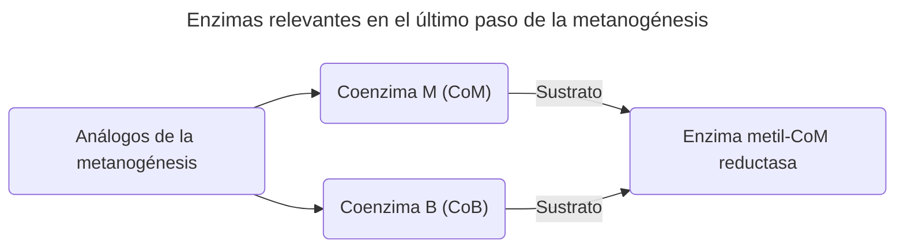
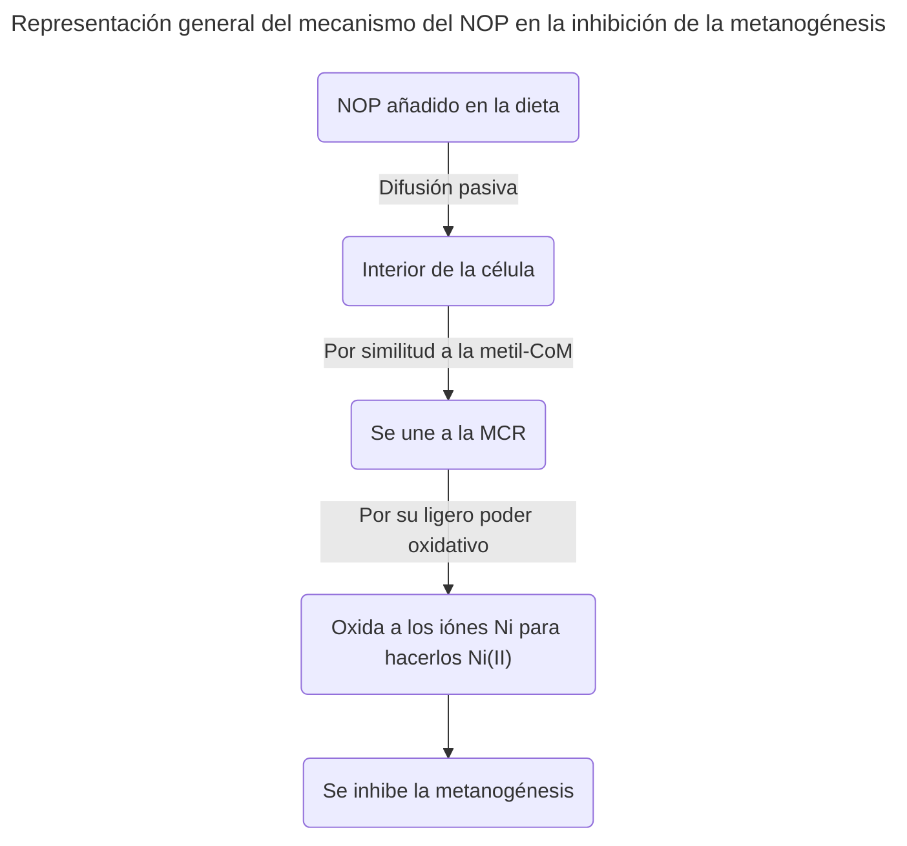

>[!Info]
>Autor(es): Romer Pérez & Beauchemin
>Publicación: 2017

> [!Abstract] 
> Los inhibidores enzimáticos son moléculas que se unen a enzimas y disminuyen su actividad. Existen diversos inhibidores  que han sido ampliamente estudiados y que han demostrado su efectividad para reducir la producción de metano (CH4)  entérico en rumiantes. Sin embargo, su uso comercial se ha visto limitado ya que pueden presentar desventajas como:  adaptación microbiana, ser tóxicos o dañinos para el medio ambiente. El reciente desarrollo de compuestos sintéticos con  elevado potencial para inhibir la producción de CH4 y que han probado su efectividad en el largo plazo ha incrementado  el interés de los investigadores en esta área del conocimiento. En este trabajo se analizan diversos inhibidores de  la metanogénesis desde una perspectiva histórica, poniendo especial énfasis en el 3-nitrooxypropanol, el cual ha sido  evaluado bajo diversas condiciones experimentales con resultados alentadores.
### [Fuente](https://www.revista-agroproductividad.org/index.php/agroproductividad/article/view/113/95)
---
# Review

	En base a su estructura química es posible dividir a los inhibidores enzimáticos de la metanogénesis en dos categorías generales: 1) Los análogos de CH4 como el cloroformo o el bromoclorometano (BCM), y 2) los análogos de la coenzima M (CoM) como el bromoetanosulfonato (BES) y el 3-ntrooxypropanol (NOP).

Si nos enfocamos en la *estructura química* que los *inhibidores enzimáticos* pueden tener, estos pueden ser divididos en *3 categorías*:
1) Análogos del $CH_4$
	1) Cloroformo
	2) Bromoclorometano (BCM)
2) Análogos de la Coenzima M (CoM)
	1) Bromoetanosulfonato (BES)
3) 3-Nitro-oxy-propanol (3- NOP)

---

	Dado que la mayor parte del CH4 en el rumen se forma a partir del CO2 y H2, una disminución en la producción de CH4 puede resultar en la acumulación de H2 en caso de que éste no sea redirigido hacia otros productos de la fermentación que requieran H2 para ser sintetizados.

La *reacción química general* de la metanogénesis hidrogenotrófica es la siguiente:
$$
4H_2 \text{ + } CO_2 \text{ = } CH_4 \text{ + } 2H_2O
$$
El *detener o reducir* la producción de metano en el rumiante puede llevar a la *acumulación* de este *gas de hidrógeno* ($H_2$) si este no es redirigido a *otras rutas metabólicas* que requieran este $H_2$

---

	El modo de acción de los análogos del CH4 está basado en la inhibición de las reacciones de transferencia del grupo metilo durante el proceso de metanogénesis que dependen de la vitamina B12 (Tomkins et al., 2009).

La forma general en que actuan los *análogos del metano*, o sea, su *mecanismo de acción*, es el de *impedir o inhibir que se transfieran grupos metilo* durante las reacciones de la metanogénesis.

---

	Van Nevel et al. (1969), reportaron que la producción de CH4 en ovinos fue completamente inhibida con la infusión de 4 g de hidrato de cloro directamente en el rumen.

Estudios reportan que la administración de *hidrato de cloro* puede llegar a ser un potente *inhibidor de la metanogénesis*, llegando a inhibir completamente la producción de metano.

---

	En general, existe una relación inversa entre el CH4 y el propionato por lo que una disminución en la producción de CH4 puede causar un aumento en la producción de propionato, ya que la síntesis de propionato representa una vía alterna para el H2 en el rumen.

Existe una *relación* entre la disminución en la *producción de metano* en el rumiante y la *producción de propianato*.
Esto es causado porque el *excedente de gas $H_2$* que puede existir al reducir o detener la producción de metano puede encontrar en la producción de *propionato* una *salida* a través de la cual ser metabolizado y *evitar así su acumulación*.

---

	Trei et al. (1971) demostraron que el uso de halometanos simples como el BCM eran potentes inhibidores de la metanogénesis

Los *halometanos*, compuestos análogos del metano en los que, en lugar de hidrógeno, son halógenos los que rodean al carbono central, han mostrado tener una *gran efectividad en inhibir la metanogénesis*.

---

	Esto fue confirmado en un experimento con novillos consumiendo 5.5 g de BCM (Johnson et al., 1972) en donde la producción de CH4 se inhibió completamente sin afectar la ganancia diaria de peso (GDP).

Los *halometanos* pueden llegar a *bloquear completamente* la metanogénesis, esto incluso *sin afectar la GDP* (ganancia diaria de peso).

---

	Debido a que los halometanos son líquidos volátiles, su utilización como aditivos alimenticios no es viable a nivel de granja;...

	... el cloroformo y el BCM los inhibidores con mayor potencial de reducción dentro de esta categoría (Knight et al., 2011; Abecia et al., 2012; Tomkins et al., 2009).

	..., la utilización de compuestos como el cloroformo y el BCM presentan diversos inconvenientes. El cloroformo es tóxico (Plaa, 2000),

	mientras que el BCM (...) puede dañar la capa de ozono (Tomkins et al., 2009).

	... los estudios más recientes utilizando estos compuestos se han realizado únicamente con el objetivo de comprender mejor el metabolismo del rumen...

A pesar de la gran potencia de los *halometanos* para blquear la metanogénesis, estos tienen el inconveniente de ser *volátiles*, por lo que *no son una opción viable* para su utilización en granjas.
Además, cada halometano en *particular* puede presentar inconvenientes adicionales:
- El cloroformo es tóxico
- El bromoclorometano (BCM) puede dañar la capa de ozono
Por lo anterior, la *investigación del uso de halometanos* en la inhibición de la metanogénesis se enfoca solo en *expandir la comprensión del metabolismo del rumen*, no en su aplicación en la industria.

---

	El estudio de los inhibidores de la metanogénesis correspondiente al grupo de análogos de la CoM tuvo su origen en los años 70’s, después del descubrimiento de dicha coenzima, la cual participa en la transferencia de grupos metilo en la metanogénesis (McBride y Wolfe, 1971). Las formas metiladas de la CoM y la coenzima B (CoB) son utilizadas como substrato por la enzima metil-CoM reductasa (MCR) en el último paso de la metanogénesis.

El estudio de los *análogos a la CoM* inició en los *70's*, después del *descubrimiento* de esta *coenzima*.
Esta enzima participa la *transferencia de grupos metilo* en la metanogénesis.
Las enzimas encargadas de esta transferencia abarcan:
- La coenzima M *(CoM)*
- La coenzima B *(CoB)*
Estas coenzimas^[La review menciona que se buscan análogos de la CoM para la inhibición de la metanogénesis, más no menciona si análogos de la CoB han sido también analizados. Se necesita investigación adicional en otras fuentes.] se *metilan* y, una vez en esta forma, son utilizadas como *sustrato* por otra enzima, la *metil-CoM reductasa*, esto en el *último paso de la metanogénesis*.

---

	Una vez que se reveló la estructura química de la CoM, una serie de experimentos se llevaron a cabo para evaluar los efectos inhibitorios de diferentes análogos estructurales, en el entendido de que estos compuestos podían competir por el sitio activo reservado para esta coenzima y de esta manera inhibir la síntesis de CH4.

Una vez conocida la estructura de la CoM fue posible analizar *compuestos similares* que pudieran *tomar el sitio activo de la metil-CoM reductasa* que originalmente le corresponde a la CoM. Si estos compuestos podían tomar ese lugar e *impedir la activación de la enzima*, entonces se podría *inhibir la metanogénesis*.

---

	...	cuando el BES se evaluó en ovinos (Immig et al., 1996), (...) evidenciando la adaptación de los microorganismos del rumen a este compuesto.

*Análogos de la CoM*, como el bromoetanosulfonato *(BES)*, han sido evaluados en ovinos y, aunque si *mostraron gran inhibición* de la metanogénesis, se encontró también que *los microorganismos del rumen se adaptaban* a este añadido.
A causa de esto, el BES se abandonó como potencial inhibidor y actualmente solo se utiliza como *modelo para nuevos compuestos*.

---

	...desarrollo de la molécula sintética NOP (Duval y Kindermann, 2012).
	Este inhibidor fue diseñado para no tener carga, permitiendo la penetración en las células por medio de difusión pasiva, y para ser moderadamente oxidante.

	La enzima MCR tiene un cofactor (F430) que posee un ion níquel el cual se puede encontrar en diferentes estados de oxidación (I, II y II) pero tiene que estar en su forma Ni(I) para ser activo (Thauer, 1998). La estructura molecular del NOP es similar a la de la metil-CoM. Esta característica, junto con su potencial moderado de oxidación permiten que el NOP se acople al sitio activo de la enzima MCR donde favorece la oxidación del ion níquel el cual pasa de su forma activa Ni(I) a su forma inactiva Ni(II), inhibiendo así el proceso de metanogénesis (Duin et al., 2016).

Una molécula sintética, llamada *3-nitro-oxy-propanol (3-NOP o NOP)* fue desarrollada por (Duval & Kindermann, 2022). Esta fue diseñada con las siguientes características:
- Que estuviera *libre de carga*
	- Esto con el fin de que pudiera *penetrar facilmente la célula*, esto por medio de la *difusión pasiva*.
- Que fuera *ligeramente oxidante*
El mecanismo que usa el NOP para inhibir la metanogénesis es, de manera general:
1) El NOP entra facilemente a las células por su nula polaridad.
2) Se une a la MCR (enzima metil-CoM reductasa) por tener una estructura similar a la de la metil-CoM.
3) El NOP oxida a los iónes de niquel.
	1) La MCR necesita de iones niquel en estado Ni(I), pero estos pueden tomar distintos estados de oxidación (I, II, III).
	2) El ligero *poder oxidativo del NOP* actua sobre los iónes niquel del medio y los lleva a un estado Ni(II), una forma que no activa la MCR
4) A falta de los iónes niquel adecuados, se inhibe la activación de la MCR y, por ende, la metanogénesis.

---

	{En] Martínez-Fernández et al. (2014) (...) el NOP (66 uM) redujo la producción de CH4 hasta en un 95%.

	en un experimento con ovinos recibiendo 0.1 g por  animal por día de NOP se observó una disminución de las emisiones de CH4 del 30% sin efectos negativos en el consumo de alimento o GDP.

	...Romero Pérez et al. (2015) con bovinos productores de carne consumiendo hasta 2.7 g por animal por día de NOP, las emisiones de CH4 disminuyeron hasta en un 33% sin afectar negativamente la digestibilidad. Al igual que otros inhibidores de la metanogénesis, el uso de NOP generó un incremento en la concentración de propionato en el rumen.

	Hristov et al. (2015) realizaron un estudio a largo plazo
	(...)
	no hubo adaptación al compuesto por parte de los microorganismos del rumen.

Estudios muestran que *el NOP tiene potencial* como estrategia en la inhibición de la metanogénesis. Este cuenta con las siguientes características:
- *Reduce* la producción de metano *sin efectos negativos en la GDP o la digestibilidad*.
- Genera un *incremento en la concentración de propionato*.
	- ==NOTA==: Esto es compartido por otros inhibidores de la metanogénesis
- *No se genera adaptación* por parte de los microorganismos.

---

	..., antes de su eventual aprobación para uso animal y su posterior adopción a nivel de granja existen otros factores que deben ser evaluados. Es necesario comprobar que el uso de NOP es seguro para los humanos, los animales y el ambiente antes de su registro para uso animal.

---

	Es más probable que el uso de NOP se adopte en sistemas de producción intensiva donde los animales consumen el alimento directamente en un comedero. En el caso de sistemas de producción extensivos, en condiciones de pastoreo, es posible que su uso sea limitado, a menos que se puedan desarrollar tecnologías para dosificar NOP bajo estas condiciones.