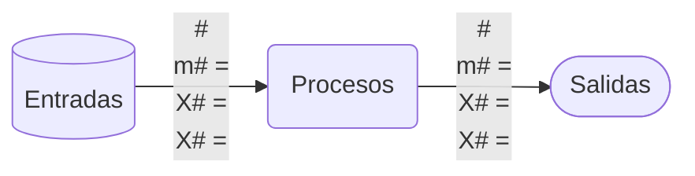

```mermaid
flowchart LR
		
		A@{ shape: cyl, label: "Entradas" }
		
		B(Procesos)
		
		C@{ shape: stadium, label: "Salidas" }
	
	A --> |#<br>m# = <br>X# = <br>X# = |B
	B --> |#<br>m# = <br>X# = <br>X# = |C
```
